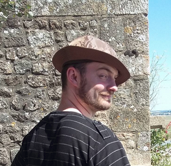

**NEWORDER**

# Nicolas Demuynck
* https://github.com/ndemuynck
* I'd like to implement AI into the field of Supply Chain Management and support logistic engineers in their task to optimize logistic flows and managing stock levels. 

> Tell me and I will listen; Teach me, and I'll remember; Involve me, and I will learn.
> - Benjamin Franklin

# Bernard Rosseel
* https://github.com/Rosseel
* I want to become a space-archeologist, a 21th century Indiana Jones including lasso and cowboyhat!!!

> The greatest happiness is to scatter your enemy, to drive him before you, to see his cities reduced to ashes, to see those who love him shrouded in tears, and to gather into your bosom his wives and daughters.
> - Genghis Khan

# Jonathan Menschaert
* https://github.com/JonathanMe658
* I would like to find a job in the medical sector to help analyze critical data.

> If you're always trying to be normal, you will never know how amazing you can be.
> - Maya Angelou
